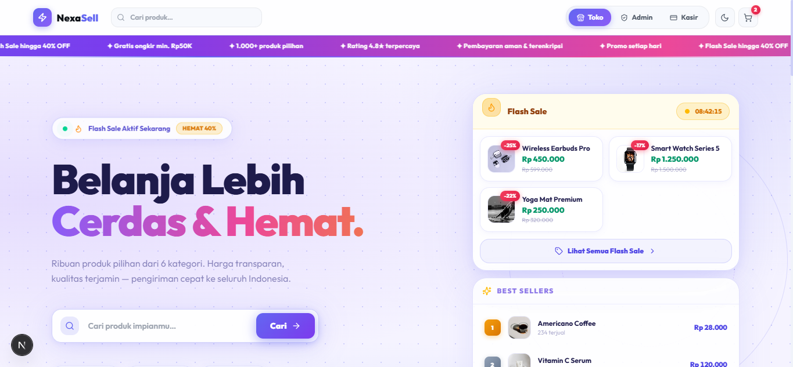
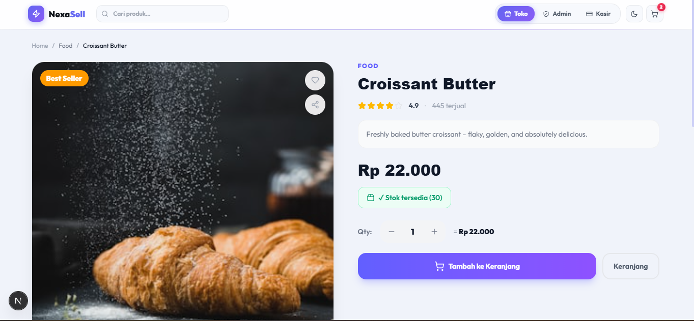
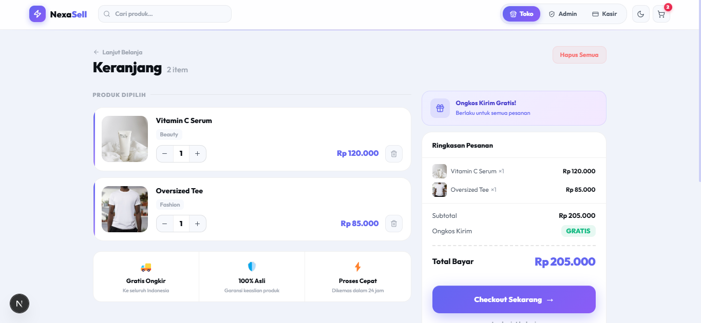
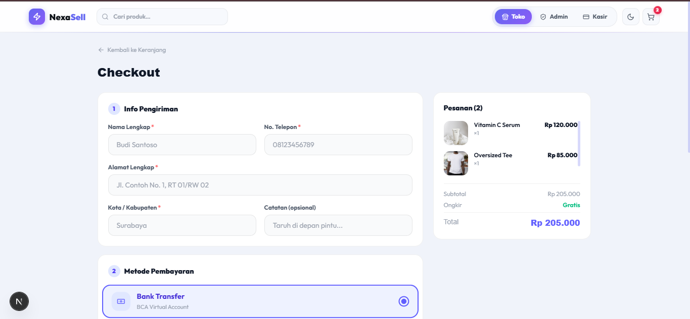
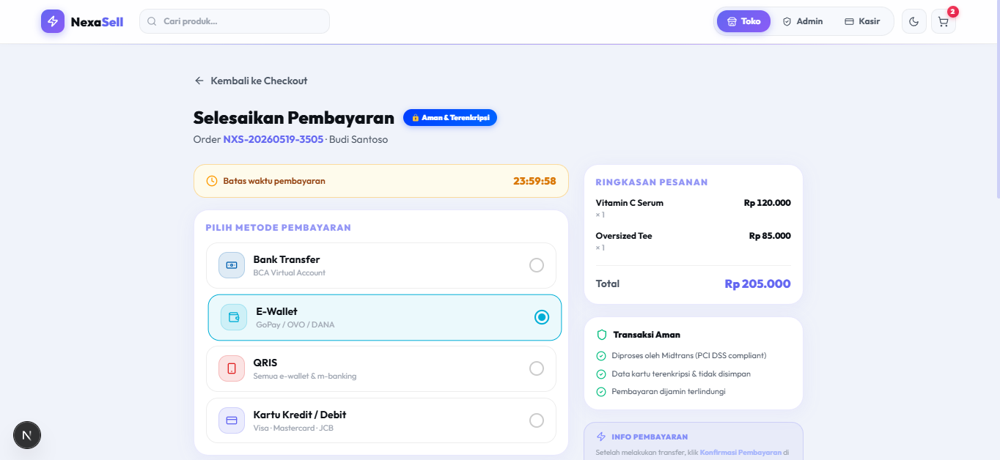
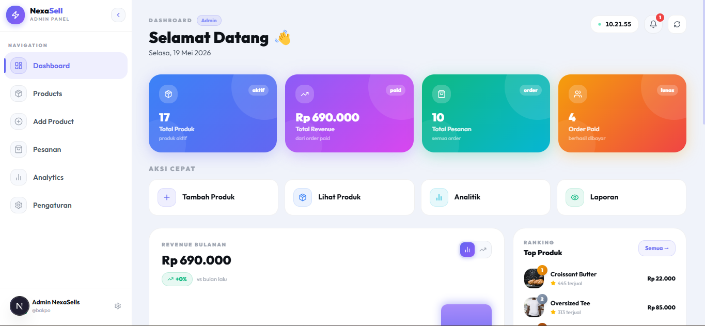
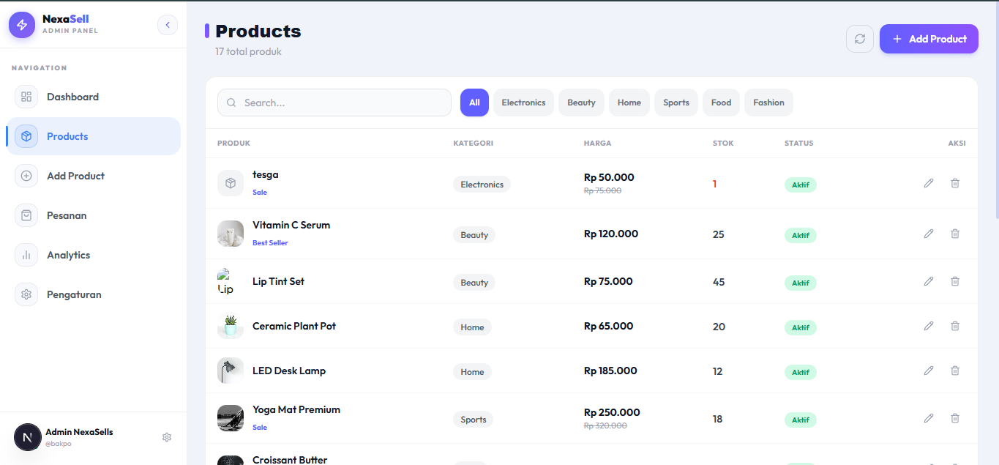
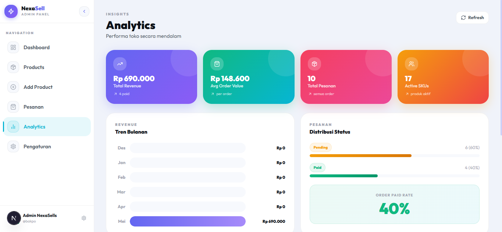
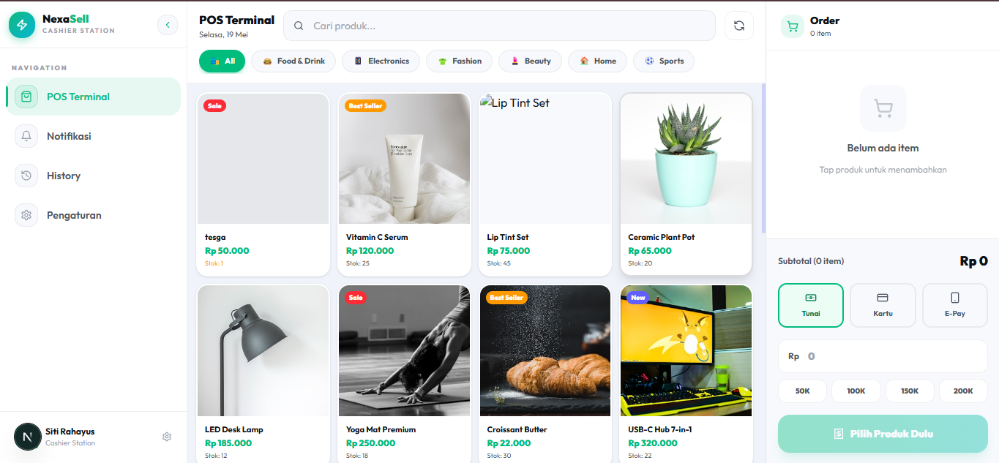
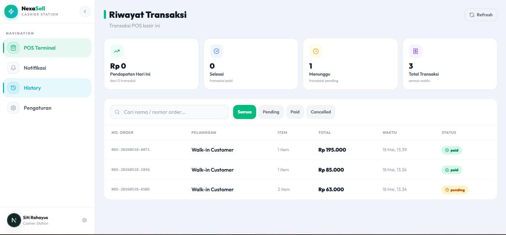

# NexaSell

**NexaSell** is a full-stack Point of Sale (POS) and online storefront system built with Next.js 16, TypeScript, Supabase, and Tailwind CSS. It combines a customer-facing shop, a cashier panel, and an admin dashboard into a single, cohesive platform.

> **Stack:** Next.js 16 · TypeScript · Supabase (PostgreSQL + Auth) · Tailwind CSS v4 · Recharts · Lucide React

## 🔑 Demo Accounts

After running `seed.js`, use these accounts to log in:

| Role | Email | Password | Login Page |
|------|-------|----------|------------|
| Admin | `admin@nexasell.id` | `admin123456` | `/admin` |
| Cashier | `kasir@nexasell.id` | `kasir123456` | `/cashier` |
| Cashier 2 | `kasir2@nexasell.id` | `kasir123456` | `/cashier` |

> These are demo credentials. Change all passwords before deploying to production.

---

## 📸 Screenshots

### 🏠 Homepage / Customer Storefront (`/`)

*Hero section with flash sale countdown, best sellers, category filter, and real-time product search.*

---

### 🛍️ Product Detail (`/customer/products/[id]`)

*Product page with image, description, stock info, quantity selector, and Add to Cart button.*

---

### 🛒 Cart (`/customer/cart`)

*Shopping cart with item list, quantity control, subtotal, and proceed to checkout button.*

---

### 📋 Checkout (`/customer/checkout`)

*Checkout form with customer info (name, phone, address), payment method selector, and order summary.*

---

### 💳 Payment (`/customer/payment`)

*Payment page showing the selected method (Bank Transfer VA, E-Wallet, QRIS, Credit Card) with instructions, countdown timer, and a Confirm Payment button that marks the order as paid.*

---

### 🖥️ Admin Dashboard (`/admin`)

*Overview of total revenue, transactions, products, and a monthly revenue chart.*

---

### 📦 Admin: Product Management (`/admin/products`)

*Product list with search, category filter, stock badges, and actions to add/edit/delete.*

---

### 📊 Admin: Analytics (`/admin/analytics`)

*Sales analytics with charts, top-selling products, and revenue breakdown.*

---

### 🧾 Cashier Panel (`/cashier`)

*POS interface for cashiers to process walk-in transactions with cash or card.*

---

### 📜 Cashier: Transaction History (`/cashier/history`)

*Daily transaction history filtered by cashier session.*

---

## ✨ Features

### 🛍️ Customer Storefront
- Hero section with promo ticker and flash sale countdown
- Real-time product search with category and sort filters
- Product detail page with stock and rating display
- Persistent shopping cart (React Context)
- Checkout form with validation
- Payment page: Bank Transfer VA, E-Wallet, QRIS, Credit Card
- 24-hour payment countdown timer
- Copy VA number and QR code display
- **Confirm Payment** button that updates order status to `paid` in real time

### 🖥️ Admin Dashboard
- Revenue overview cards and monthly chart (Recharts)
- Full product CRUD: add, edit, delete with image upload
- Order management with status filters
- Analytics page with top products and revenue breakdown
- Store settings

### 💳 Cashier Panel
- POS interface for processing cash/card walk-in orders
- Real-time stock deduction on sale
- Daily transaction history
- Cashier profile settings
- Notification bell for new orders

### 🎨 UI/UX
- Dark / Light mode with zero flash (SSR-safe inline script)
- Fully responsive, mobile-first design
- Smooth animations with CSS keyframes
- Promo ticker, trust badges, category pill filters

---

## 🗂️ Project Structure

```
nexasell/
├── app/
│   ├── page.tsx                  # Customer storefront (homepage)
│   ├── layout.tsx                # Root layout + ThemeProvider + CartProvider
│   ├── globals.css               # CSS variables, animations
│   ├── api/
│   │   ├── orders/               # GET, POST orders; PATCH by ID
│   │   ├── products/             # GET, POST products; PATCH/DELETE by ID
│   │   ├── payment/
│   │   │   ├── create/           # POST — create Midtrans Snap token
│   │   │   └── notification/     # POST — Midtrans webhook handler
│   │   ├── notifications/        # GET notifications
│   │   ├── upload/               # POST image upload (Supabase Storage)
│   │   ├── admin/                # Admin profile & analytics
│   │   └── cashier/              # Cashier profile
│   ├── customer/
│   │   ├── products/[id]/        # Product detail page
│   │   ├── cart/                 # Shopping cart
│   │   ├── checkout/             # Checkout form
│   │   └── payment/              # Payment confirmation page
│   ├── admin/
│   │   ├── page.tsx              # Admin dashboard
│   │   ├── products/             # Product list + add/edit
│   │   ├── orders/               # Order management
│   │   ├── analytics/            # Analytics page
│   │   └── settings/             # Store settings
│   └── cashier/
│       ├── page.tsx              # Cashier POS
│       ├── history/              # Transaction history
│       ├── notifications/        # Notifications
│       └── settings/             # Cashier settings
├── components/
│   ├── ui/                       # Navbar, Footer
│   ├── admin/                    # AdminSidebar, RevenueChart
│   ├── cashier/                  # CashierSidebar, CashierHeader
│   └── customer/                 # ProductCard
├── lib/
│   ├── CartContext.tsx           # Global cart state
│   ├── ThemeContext.tsx          # Dark/light mode
│   ├── SidebarContext.tsx        # Sidebar collapse state
│   ├── supabase/                 # Supabase client (server + browser)
│   └── utils.ts                  # formatRupiah, helpers
└── supabase/
    └── schema.sql                # Full database schema
```

---

## 🚀 Getting Started

### Prerequisites
- Node.js 18+
- A [Supabase](https://supabase.com) project (free tier works)

### 1. Clone & Install

```bash
git clone https://github.com/0xrayn/nexasell.git
cd nexasell
npm install
```

### 2. Set Up Supabase

1. Create a new project at [supabase.com](https://supabase.com)
2. Go to **Project Settings → API** and copy your `URL`, `anon key`, and `service_role key` (you'll need them in step 3)
3. Go to **SQL Editor** and run the following files **in this exact order**:

---

#### 📄 `supabase/schema.sql` — Run first
The base schema. Creates everything from scratch:
- **Enum types:** `user_role`, `order_status`, `pay_method`, `pay_status`
- **Tables:** `profiles`, `products`, `orders`, `order_items`
- **Indexes** on commonly queried columns (category, status, cashier_id, created_at)
- **Auto `updated_at` trigger** on profiles, products, and orders
- **Row Level Security (RLS)**, products are publicly readable; orders are scoped to their cashier or admin
- **RPC function** `decrement_stock(product_id, qty)`, atomically reduces stock and increments `sold` count when an order is placed
- **16 sample products** across 6 categories (food, electronics, fashion, beauty, home, sports) with Unsplash images

---

#### 📄 `migration_fix_rls_order_items.sql`, Run second
Patches missing RLS policies for the `order_items` table. **Without this, online checkout will fail** with a Supabase permission error. Adds:
- Admin → full access to all `order_items`
- Cashier → can read `order_items` for their own orders
- Public (unauthenticated) → can `INSERT` into `order_items` (required for guest checkout)
- Public → can `INSERT` into `orders` where `source = 'online'`

---

#### 📄 `migration_add_username_shift.sql`, Run third
Adds two columns to the `profiles` table needed by the cashier settings page:
```sql
username TEXT
shift    TEXT  DEFAULT 'pagi'
```

---

#### 📄 `migration_add_notif_preferences.sql`, Run fourth
Adds the notification preferences column used by the cashier/admin settings:
```sql
notif_preferences JSONB  DEFAULT '{}'
```

> **Note:** `migration_add_notif_preferences_v2.sql` combines the above two migrations into one. If you haven't run migrations 3 and 4 yet, you can run just this file instead of both, it uses `ADD COLUMN IF NOT EXISTS` so it's safe to run even if the columns already exist.

### 3. Seed Default Users (optional)

`seed.js` creates the 3 demo accounts listed at the top of this README. Before running, open `seed.js` and replace lines 3–6 with your own project credentials:

```js
// seed.js, edit these two lines
const supabase = createClient(
  'https://YOUR_PROJECT_ID.supabase.co',   // ← your project URL
  'your-service-role-key-here'              // ← service_role key (NOT anon key)
)
```

Get both values from **Supabase Dashboard → Project Settings → API**.

```bash
node seed.js
```

After seeding, log in at `/admin` or `/cashier` with the credentials above. **Change the passwords immediately** in a production environment.

Alternatively, create users manually: go to **Supabase Dashboard → Authentication → Users → Add User**, then run this SQL to assign a role:

```sql
INSERT INTO profiles (id, role, full_name)
VALUES ('paste-user-uuid-here', 'admin', 'Your Name');
```

---

### 4. Configure Environment Variables

Create a `.env.local` file in the project root:

```env
# Supabase
NEXT_PUBLIC_SUPABASE_URL=https://your-project.supabase.co
NEXT_PUBLIC_SUPABASE_ANON_KEY=your-anon-key
SUPABASE_SERVICE_ROLE_KEY=your-service-role-key

# App URL (used for payment callbacks)
NEXT_PUBLIC_APP_URL=http://localhost:3000

# Midtrans (optional, only needed for real payment gateway)
MIDTRANS_SERVER_KEY=SB-Mid-server-xxxx
MIDTRANS_IS_PRODUCTION=false
```

> Get your Supabase keys from: **Project Settings → API**

### 5. Run Development Server

```bash
npm run dev
```

Open [http://localhost:3000](http://localhost:3000) in your browser.

### 6. Create Admin / Cashier Account

If you skipped the seed script, create accounts manually:

1. Go to your Supabase project → **Authentication → Users → Add User**
2. After creating, run this SQL to assign a role:

```sql
INSERT INTO profiles (id, role, full_name)
VALUES ('your-user-uuid', 'admin', 'Admin Name');
```

Use `'cashier'` instead of `'admin'` for cashier accounts.

---

## 🛠️ Tech Stack

| Layer | Technology |
|-------|------------|
| Framework | Next.js 16 (App Router) |
| Language | TypeScript |
| Database | Supabase (PostgreSQL) |
| Auth | Supabase Auth |
| Styling | Tailwind CSS v4 + CSS Variables |
| Icons | Lucide React |
| Charts | Recharts |
| State | React Context API |
| Storage | Supabase Storage (images) |

---

## ⚠️ Known Limitations & What's Missing

### 💳 Payment Gateway, Not Fully Integrated
The app includes a payment UI (Bank Transfer VA, E-Wallet, QRIS, Credit Card) and the backend route `POST /api/payment/create` is already wired to the **Midtrans Snap API**. However, it requires a Midtrans account and server key to function.

**To enable real payments with Midtrans:**
1. Sign up at [midtrans.com](https://midtrans.com) and get your server key
2. Add `MIDTRANS_SERVER_KEY` to `.env.local`
3. Load the Midtrans Snap JS in `app/layout.tsx`:
   ```html
   <script src="https://app.sandbox.midtrans.com/snap/snap.js" data-client-key="YOUR_CLIENT_KEY" />
   ```
4. On the payment page, call `window.snap.pay(snap_token)` after getting the token from `POST /api/payment/create`
5. The webhook handler at `POST /api/payment/notification` is ready to receive Midtrans callbacks and update order status

**Alternative payment gateways you could integrate instead:**
- [**Xendit**](https://xendit.co), popular in Indonesia, supports VA, QRIS, e-wallets
- [**Duitku**](https://duitku.com), local Indonesian gateway, simpler setup
- [**Stripe**](https://stripe.com), if targeting international customers

### 📧 No Email Notifications
There is no order confirmation email sent to customers after checkout. You could add this with:
- [Resend](https://resend.com) + React Email
- [Nodemailer](https://nodemailer.com) with an SMTP provider

### 📦 No Shipping / Logistics Integration
Shipping cost is currently hardcoded to `0` (free shipping). For real shipping rates, consider integrating [Raja Ongkir](https://rajaongkir.com) (Indonesia courier API).

### 🔔 No Real-Time Notifications
Notifications currently require a page refresh. Upgrading to Supabase Realtime or WebSockets would enable live order alerts for cashiers and admins.

### 🏪 Single Store Only
The system is designed for a single store. Multi-branch or multi-tenant support would require a significant schema redesign.

---

## 🛣️ Roadmap

- [ ] Midtrans Snap full integration (frontend scaffold already done)
- [ ] Email order confirmation (Resend / Nodemailer)
- [ ] PDF receipt generation
- [ ] Raja Ongkir shipping rate integration
- [ ] Real-time order notifications (Supabase Realtime)
- [ ] PWA support (offline cashier mode)
- [ ] Export reports to Excel / PDF
- [ ] Multi-language support (i18n)

---

## 🔒 Security Notes

- Never commit `.env.local` to version control, it's in `.gitignore`
- `SUPABASE_SERVICE_ROLE_KEY` bypasses RLS, only use it server-side (API routes)
- `MIDTRANS_SERVER_KEY` must never be exposed to the browser

---

## 📄 License

MIT License © [0xrayn](https://github.com/0xrayn)

Permission is hereby granted, free of charge, to any person obtaining a copy of this software and associated documentation files (the "Software"), to deal in the Software without restriction, including without limitation the rights to use, copy, modify, merge, publish, distribute, sublicense, and/or sell copies of the Software, and to permit persons to whom the Software is furnished to do so, subject to the following conditions:

The above copyright notice and this permission notice shall be included in all copies or substantial portions of the Software.

THE SOFTWARE IS PROVIDED "AS IS", WITHOUT WARRANTY OF ANY KIND, EXPRESS OR IMPLIED, INCLUDING BUT NOT LIMITED TO THE WARRANTIES OF MERCHANTABILITY, FITNESS FOR A PARTICULAR PURPOSE AND NONINFRINGEMENT. IN NO EVENT SHALL THE AUTHORS OR COPYRIGHT HOLDERS BE LIABLE FOR ANY CLAIM, DAMAGES OR OTHER LIABILITY, WHETHER IN AN ACTION OF CONTRACT, TORT OR OTHERWISE, ARISING FROM, OUT OF OR IN CONNECTION WITH THE SOFTWARE OR THE USE OR OTHER DEALINGS IN THE SOFTWARE.
